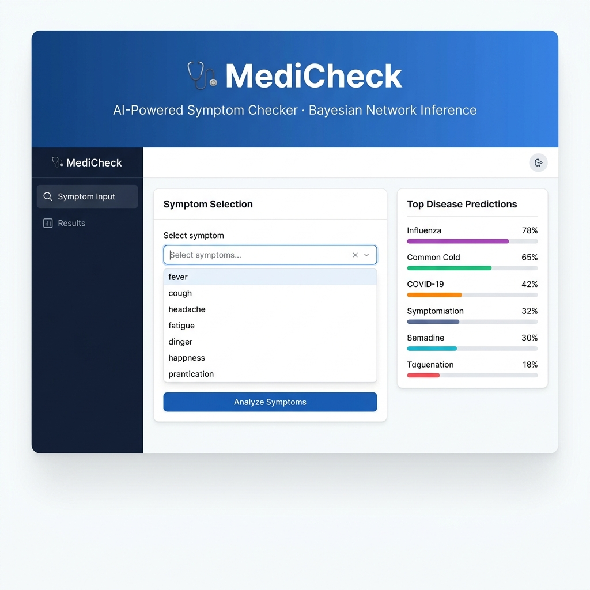

# MediCheck – AI Symptom Checker 🩺


> **Disclaimer:** This project is for **educational and academic purposes only**. It is NOT a medical diagnosis tool and must never be used as a substitute for professional medical advice.

## Overview

MediCheck is an AI-powered Medical Symptom Checker that uses a **Bayesian Network** to predict the most likely disease(s) based on user-entered symptoms. The system employs a Naive Bayes graphical model trained on synthetic healthcare data and performs inference via **Variable Elimination**.

## 📸 Screenshot



## Architecture

```
┌────────────────┐     POST /predict     ┌────────────────┐     pgmpy VE     ┌──────────────┐
│   Streamlit    │ ──────────────────────▶│    FastAPI      │ ───────────────▶│  Bayesian    │
│   Frontend     │◀────── JSON ──────────│    Gateway      │◀───────────────│  Network     │
└────────────────┘                       └────────────────┘                 └──────────────┘
```

## Tech Stack

| Layer      | Technology                |
|------------|---------------------------|
| Frontend   | Streamlit 1.32+           |
| API        | FastAPI 0.110+ / Uvicorn  |
| ML Model   | pgmpy (Bayesian Network)  |
| Data       | pandas, numpy             |
| Viz        | Plotly, Altair            |
| Testing    | pytest                    |

## File Structure

```
medicheck/
├── data/
│   ├── disease_symptom.csv      # Training data (auto-generated)
│   └── disease_info.json        # Disease descriptions & actions
├── model/
│   ├── train.py                 # BN training pipeline
│   ├── inference.py             # Variable Elimination inference
│   └── bayesian_model.pkl       # Serialised model (generated)
├── api/
│   ├── main.py                  # FastAPI app & endpoints
│   ├── schemas.py               # Pydantic models
│   └── utils.py                 # Helper utilities
├── frontend/
│   ├── app.py                   # Streamlit entry point
│   └── pages/
│       ├── symptom_input.py     # Symptom selection UI
│       └── results.py           # Results visualisation
├── tests/
│   ├── test_inference.py        # Model & inference tests
│   └── test_api.py              # API endpoint tests
├── requirements.txt
└── README.md
```

## Quick Start

### 1. Install Dependencies

```bash
cd medicheck
pip install -r requirements.txt
```

### 2. Train the Model

```bash
python -m model.train
```

This will:
- Generate `data/disease_symptom.csv` (216 records, 18 diseases, 52 symptoms)
- Train the Bayesian Network with BDeu priors
- Save `model/bayesian_model.pkl`

### 3. Start the API

```bash
uvicorn api.main:app --reload --host 0.0.0.0 --port 8000
```

API docs available at: `http://localhost:8000/docs`

### 4. Launch the Frontend

```bash
streamlit run frontend/app.py
```

Open `http://localhost:8501` in your browser.

### 5. Run Tests

```bash
pytest tests/ -v
```

## API Endpoints

| Method | Path        | Description                           |
|--------|-------------|---------------------------------------|
| GET    | `/health`   | Health check & model status           |
| GET    | `/symptoms` | List all recognised symptoms          |
| POST   | `/predict`  | Predict diseases from symptom list    |

### Example Request

```bash
curl -X POST http://localhost:8000/predict \
  -H "Content-Type: application/json" \
  -d '{"symptoms": ["fever", "cough", "shortness_of_breath"]}'
```

## Model Details

- **Structure:** Naive Bayes Bayesian Network (Disease → Symptom₁, Disease → Symptom₂, …)
- **Estimation:** Bayesian Estimation with BDeu prior (equivalent sample size = 5)
- **Inference:** Variable Elimination for exact posterior computation
- **Diseases:** 18 conditions across respiratory, neurological, metabolic, and infectious categories
- **Symptoms:** 52 clinical features

## Environment Setup

```bash
cp .env.example .env
# Edit .env with your values (optional – defaults work out of the box)
```

> **Note:** The `.env` file is git-ignored. Never commit real credentials.

## Contributing

1. Fork the repository
2. Create a feature branch (`git checkout -b feature/amazing-feature`)
3. Commit your changes (`git commit -m 'Add amazing feature'`)
4. Push to the branch (`git push origin feature/amazing-feature`)
5. Open a Pull Request

## License

This project is intended for academic use. No medical claims are made.
